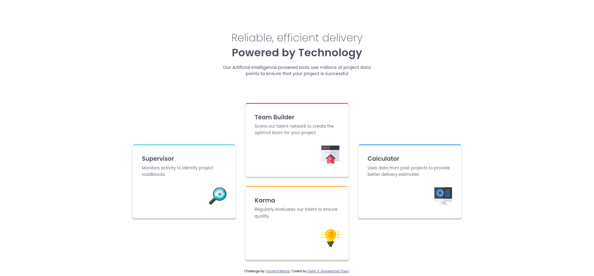

# Frontend Mentor - Four card feature section solution

This is a solution to the [Four card feature section challenge on Frontend Mentor](https://www.frontendmentor.io/challenges/four-card-feature-section-weK1eFYK). Frontend Mentor challenges help you improve your coding skills by building realistic projects. 

## Table of contents

- [Overview](#overview)
  - [The challenge](#the-challenge)
  - [Screenshot](#screenshot)
  - [Links](#links)
- [My process](#my-process)
  - [Built with](#built-with)
  - [What I learned](#what-i-learned)
  - [Continued development](#continued-development)
- [Author](#author)

**Note: Delete this note and update the table of contents based on what sections you keep.**

## Overview

### The challenge

Users should be able to:

- View the optimal layout for the site depending on their device's screen size

### Screenshot

### Links

- Solution URL: [https://github.com/vanhog/frontend-mentor-four-card-feature-section](https://github.com/vanhog/frontend-mentor-four-card-feature-section)
- Live Site URL: [https://dees-frontend-mentor-four-card-sect.netlify.app/](https://dees-frontend-mentor-four-card-sect.netlify.app/)

## My process

### Built with

- Semantic HTML5 markup
- CSS custom properties
- Flexbox
- CSS Grid
- Mobile-first workflow

### What I learned

I fiddled around quite a bit until I figured out how to build a grid to control the card positions and adapt it to different devices according to the specifications. Thus, I learned a lot about grid usage.

### Continued development

I'm wondering if there isn't an alternative way to implement the cross-stack layout.

## Author

- Website - [Dieter H. Hoogestraat (Dee)](https://www.hoogestraat.com)
- Frontend Mentor - [@vanhog](https://www.frontendmentor.io/profile/vanhog)

  